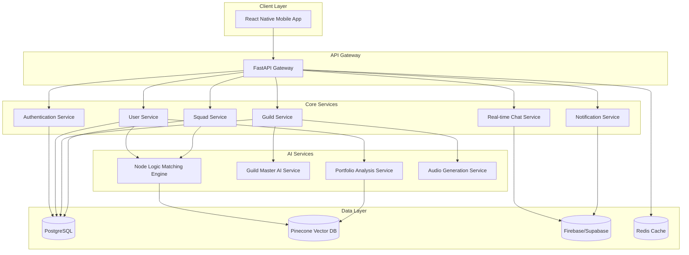

# Design Document: ORIGIN Learning Platform

## Overview

ORIGIN is a mobile-first adaptive learning platform that connects learners through AI-managed guilds. The system architecture follows a microservices pattern with a React Native mobile frontend, Python FastAPI backend, and specialized AI services for matching, curriculum generation, and content analysis.

The platform's core innovation lies in its three-layer intelligence system:
1. **Node Logic**: Vector-based matching engine that forms compatible learning squads
2. **Guild Master AI**: Adaptive curriculum generator that personalizes learning paths
3. **Mool System**: Reputation-based mastery verification with peer review

The design prioritizes mobile-first user experience, real-time collaboration, and scalable AI-driven personalization.

## Architecture

### High-Level Architecture



### Technology Stack

**Frontend:**
- React Native 0.72+ for cross-platform mobile development
- React Navigation for routing
- React Query for server state management
- Zustand for client state management
- React Native Paper for UI components (customized with brand colors)

**Backend:**
- Python 3.11+ with FastAPI framework
- Pydantic for data validation
- SQLAlchemy for ORM
- Alembic for database migrations
- Celery for background task processing
- Redis for caching and task queue

**AI/ML:**
- OpenAI GPT-4o or Google Gemini 1.5 Pro for Guild Master
- Sentence Transformers for vector embeddings
- Pinecone for vector similarity search
- LangChain for AI orchestration

**Data Storage:**
- PostgreSQL 15+ for relational data
- Pinecone for vector embeddings
- Firebase/Supabase for real-time chat
- Redis for session management and caching

**Infrastructure:**
- Docker for containerization
- Kubernetes for orchestration (production)
- GitHub Actions for CI/CD
- AWS/GCP for cloud hosting

## Components and Interfaces

### 1. Authentication Service

**Responsibility:** Manages user authentication, authorization, and session management.

**Interfaces:**

```python
class AuthService:
    def register_user(email: str, password: str, profile_data: dict) -> User:
        """
        Register a new user with email and password.
        Returns User object with authentication token.
        """
        pass
    
    def login(email: str, password: str) -> AuthToken:
        """
        Authenticate user and return JWT token.
        """
        pass
    
    def refresh_token(refresh_token: str) -> AuthToken:
        """
        Refresh expired access token using refresh token.
        """
        pass
    
    def logout(user_id: str) -> bool:
        """
        Invalidate user session and tokens.
        """
        pass
    
    def verify_token(token: str) -> User:
        """
        Verify JWT token and return associated user.
        """
        pass
```

**Security:**
- Passwords hashed with bcrypt (12 rounds minimum)
- JWT tokens with 15-minute access token expiry, 7-day refresh token expiry
- Rate limiting: 5 login attempts per 15 minutes per IP
- HTTPS/TLS 1.3 required for all endpoints

### 2. User Service

**Responsibility:** Manages user profiles, preferences, and skill assessments.

**Interfaces:**

```python
class UserService:
    def create_profile(user_id: str, profile_data: ProfileData) -> UserProfile:
        """
        Create user profile with interests, timezone, and language.
        """
        pass
    
    def update_profile(user_id: str, updates: dict) -> UserProfile:
        """
        Update user profile fields.
        """
        pass
    
    def get_profile(user_id: str) -> UserProfile:
        """
        Retrieve user profile by ID.
        """
        pass
    
    def update_skill_level(user_id: str, skill_assessment: SkillAssessment) -> UserProfile:
        """
        Update user skill level based on portfolio analysis or manual input.
        """
        pass
    
    def get_learning_velocity(user_id: str) -> float:
        """
        Calculate user's learning velocity based on task completion history.
        """
        pass
    
    def update_vector_embedding(user_id: str) -> VectorEmbedding:
        """
        Regenerate user's vector embedding for matching.
        """
        pass
```

### 3. Portfolio Analysis Service

**Responsibility:** Analyzes user portfolios from multiple sources to assess skill levels.

**Interfaces:**

```python
class PortfolioAnalysisService:
    def analyze_github(github_url: str) -> SkillAssessment:
        """
        Analyze GitHub profile and repositories.
        Returns skill level (1-10) and detected technologies.
        """
        pass
    
    def analyze_linkedin(linkedin_profile: dict) -> SkillAssessment:
        """
        Analyze LinkedIn work experience and skills.
        Returns skill level and experience summary.
        """
        pass
    
    def parse_resume(file_content: bytes, file_type: str) -> SkillAssessment:
        """
        Parse resume (PDF/DOCX/TXT) and extract skills.
        Returns skill level and experience data.
        """
        pass
    
    def analyze_portfolio_website(url: str) -> SkillAssessment:
        """
        Scrape and analyze portfolio website.
        Returns skill level and project information.
        """
        pass
    
    def combine_assessments(assessments: List[SkillAssessment]) -> SkillAssessment:
        """
        Merge multiple skill assessments into unified score.
        Weights recent data more heavily.
        """
        pass
    
    def generate_vector_embedding(skill_assessment: SkillAssessment, 
                                  timezone: str, 
                                  language: str) -> VectorEmbedding:
        """
        Generate vector embedding for matching algorithm.
        """
        pass
```

**Implementation Details:**
- GitHub API integration with OAuth for private repos (optional)
- LinkedIn API integration (requires user consent)
- Resume parsing using PyPDF2, python-docx, and spaCy NLP
- Web scraping with BeautifulSoup4 and rate limiting
- Skill extraction using pre-trained NER models
- Embedding generation using Sentence Transformers (all-MiniLM-L6-v2)

### 4. Node Logic Matching Engine

**Responsibility:** Matches users into compatible squads using vector similarity.

**Interfaces:**

```python
class NodeLogicMatcher:
    def find_squad_matches(user_id: str, guild_id: str) -> List[Squad]:
        """
        Find compatible squads for user within specified guild.
        Returns squads with similarity score > 0.7.
        """
        pass
    
    def create_new_squad(guild_id: str, initial_members: List[str]) -> Squad:
        """
        Create new squad with initial members.
        """
        pass
    
    def add_member_to_squad(squad_id: str, user_id: str) -> Squad:
        """
        Add user to existing squad if compatible and space available.
        """
        pass
    
    def calculate_compatibility(user1_embedding: VectorEmbedding, 
                               user2_embedding: VectorEmbedding) -> float:
        """
        Calculate cosine similarity between user embeddings.
        Returns score between 0 and 1.
        """
        pass
    
    def get_waiting_pool(guild_id: str) -> List[User]:
        """
        Get users waiting for squad assignment in guild.
        """
        pass
    
    def rebalance_squads(guild_id: str) -> List[Squad]:
        """
        Periodic rebalancing of squads based on updated embeddings.
        """
        pass
```

**Matching Algorithm:**
1. Retrieve user's vector embedding from Pinecone
2. Query Pinecone for similar users in same guild (cosine similarity)
3. Filter candidates by timezone compatibility (±3 hours) and language match
4. Find squads with similarity score > 0.7 and space available (< 15 members)
5. If no match found, add user to waiting pool
6. When waiting pool reaches 12+ compatible users, form new squad

**Vector Embedding Dimensions:**
- Skill level (1-10): normalized to [0, 1]
- Learning velocity: normalized task completion rate
- Timezone: encoded as hour offset from UTC
- Language: one-hot encoded (top 20 languages)
- Interest area: embedded using Sentence Transformers
- Total dimensions: 384 (from Sentence Transformer model)

### 5. Guild Service

**Responsibility:** Manages guilds, membership, and guild-level operations.

**Interfaces:**

```python
class GuildService:
    def create_guild(name: str, interest_area: str, guild_type: GuildType) -> Guild:
        """
        Create new guild (public, premium, or private).
        """
        pass
    
    def get_guild(guild_id: str) -> Guild:
        """
        Retrieve guild details.
        """
        pass
    
    def list_guilds(filters: GuildFilters) -> List[Guild]:
        """
        List available guilds with filtering.
        """
        pass
    
    def join_guild(user_id: str, guild_id: str) -> Membership:
        """
        Add user to guild and initiate squad matching.
        """
        pass
    
    def leave_guild(user_id: str, guild_id: str) -> bool:
        """
        Remove user from guild and associated squad.
        """
        pass
    
    def get_guild_analytics(guild_id: str) -> GuildAnalytics:
        """
        Get guild-level analytics (for B2B private guilds).
        """
        pass
```

### 6. Squad Service

**Responsibility:** Manages squad operations, member interactions, and squad lifecycle.

**Interfaces:**

```python
class SquadService:
    def get_squad(squad_id: str) -> Squad:
        """
        Retrieve squad details and member list.
        """
        pass
    
    def get_user_squads(user_id: str) -> List[Squad]:
        """
        Get all squads user is member of.
        """
        pass
    
    def get_squad_progress(squad_id: str) -> SquadProgress:
        """
        Calculate squad's overall progress through syllabus.
        """
        pass
    
    def record_task_completion(user_id: str, task_id: str, completion_time: datetime) -> TaskCompletion:
        """
        Record user's task completion for velocity tracking.
        """
        pass
    
    def get_squad_leaderboard(squad_id: str) -> List[UserProgress]:
        """
        Get squad members ranked by completion rate.
        """
        pass
```

### 7. Guild Master AI Service

**Responsibility:** Generates adaptive curricula, audio standups, and icebreakers.

**Interfaces:**

```python
class GuildMasterService:
    def generate_syllabus(squad_id: str) -> Syllabus:
        """
        Generate 30-day learning roadmap for squad.
        Analyzes member skill levels and creates personalized curriculum.
        """
        pass
    
    def pivot_syllabus(squad_id: str, performance_data: SquadProgress) -> Syllabus:
        """
        Adjust syllabus based on squad performance.
        Called when completion rate < 60% for 3+ consecutive days.
        """
        pass
    
    def generate_audio_standup(squad_id: str) -> AudioStandup:
        """
        Generate weekly audio summary of squad progress.
        Returns audio file URL and transcript.
        """
        pass
    
    def generate_icebreakers(squad_id: str) -> List[Icebreaker]:
        """
        Generate personalized icebreaker questions for squad.
        """
        pass
    
    def facilitate_networking(squad_id: str) -> List[Pairing]:
        """
        Create 1-on-1 pairings for networking activity.
        """
        pass
    
    def assess_project(project_submission: ProjectSubmission) -> ProjectAssessment:
        """
        AI assessment of level-up project submission.
        Returns approval/rejection with detailed feedback.
        """
        pass
```

**AI Implementation:**
- LLM: OpenAI GPT-4o or Google Gemini 1.5 Pro
- Prompt engineering with few-shot examples for consistency
- Syllabus generation uses structured output format (JSON)
- Audio generation using OpenAI TTS or Google Cloud Text-to-Speech
- Context window management for long squad histories

**Syllabus Generation Algorithm:**
1. Retrieve squad member profiles and skill assessments
2. Calculate median skill level and skill variance
3. Query LLM with prompt template including:
   - Guild interest area
   - Squad skill distribution
   - Learning objectives
   - 30-day timeframe constraint
4. Parse LLM response into structured syllabus format
5. Store syllabus with daily tasks, resources, and milestones

**Pivot Logic:**
- Monitor daily completion rates per squad
- If completion rate < 60% for 3 consecutive days, trigger pivot
- Analyze which tasks have low completion
- Generate adjusted syllabus with:
  - Reduced difficulty for struggling topics
  - Extended time for complex concepts
  - Additional resources and examples
  - Simplified project requirements

### 8. Mool Reputation System

**Responsibility:** Manages reputation points, peer reviews, and level progression.

**Interfaces:**

```python
class MoolSystem:
    def submit_work_for_review(user_id: str, work_submission: WorkSubmission) -> Review:
        """
        Submit work for peer review.
        Notifies eligible reviewers.
        """
        pass
    
    def submit_peer_review(reviewer_id: str, review_id: str, review_content: ReviewContent) -> Review:
        """
        Submit peer review and award reputation points.
        """
        pass
    
    def calculate_reputation_award(review: Review, reviewer_level: int) -> int:
        """
        Calculate reputation points for review.
        Higher-level reviewers earn more points.
        """
        pass
    
    def get_user_reputation(user_id: str) -> int:
        """
        Get total reputation points for user.
        """
        pass
    
    def submit_levelup_project(user_id: str, project: ProjectSubmission) -> LevelUpRequest:
        """
        Submit project for level-up assessment.
        """
        pass
    
    def assign_peer_reviewers(levelup_request_id: str) -> List[User]:
        """
        Assign two senior guild members as peer reviewers.
        """
        pass
    
    def process_levelup_approval(levelup_request_id: str) -> LevelUpResult:
        """
        Process level-up after AI and peer approvals.
        """
        pass
    
    def get_eligible_reviewers(work_submission: WorkSubmission) -> List[User]:
        """
        Find users eligible to review submission.
        Excludes direct collaborators.
        """
        pass
```

**Reputation Calculation:**
- Base points per review: 10
- Multiplier for reviewer level: 1 + (reviewer_level * 0.1)
- Quality bonus: +5 points for detailed reviews (> 200 words)
- Consistency bonus: +3 points for reviews within 24 hours
- Maximum points per review: 25

**Level-Up Requirements:**
- Complete all tasks for current level
- Submit capstone project
- Pass AI quality assessment (automated code review, completeness check)
- Receive approval from 2 peer reviewers (minimum 2 levels higher)
- Peer reviewers must provide written feedback (minimum 100 words)

### 9. Real-Time Chat Service

**Responsibility:** Manages squad chat, message delivery, and chat history.

**Interfaces:**

```python
class ChatService:
    def create_squad_channel(squad_id: str) -> ChatChannel:
        """
        Create dedicated chat channel for squad.
        """
        pass
    
    def send_message(user_id: str, channel_id: str, message: Message) -> Message:
        """
        Send message to squad channel.
        Delivers to online members, queues for offline.
        """
        pass
    
    def get_message_history(channel_id: str, limit: int, before: datetime) -> List[Message]:
        """
        Retrieve chat history with pagination.
        """
        pass
    
    def upload_attachment(user_id: str, channel_id: str, file: File) -> Attachment:
        """
        Upload file attachment to chat.
        """
        pass
    
    def mention_user(message_id: str, mentioned_user_id: str) -> Notification:
        """
        Notify mentioned user.
        """
        pass
    
    def mark_as_read(user_id: str, channel_id: str, last_read_message_id: str) -> bool:
        """
        Update user's last read message.
        """
        pass
```

**Implementation:**
- Firebase Realtime Database or Supabase for real-time sync
- WebSocket connections for live updates
- Message delivery guarantee: at-least-once
- Offline message queue with 7-day retention
- File uploads to cloud storage (AWS S3/GCS) with CDN
- Message size limit: 10KB text, 10MB files

### 10. Notification Service

**Responsibility:** Manages push notifications and notification preferences.

**Interfaces:**

```python
class NotificationService:
    def send_push_notification(user_id: str, notification: Notification) -> bool:
        """
        Send push notification to user's device.
        """
        pass
    
    def register_device(user_id: str, device_token: str, platform: str) -> Device:
        """
        Register device for push notifications.
        """
        pass
    
    def update_preferences(user_id: str, preferences: NotificationPreferences) -> NotificationPreferences:
        """
        Update user's notification preferences.
        """
        pass
    
    def get_preferences(user_id: str) -> NotificationPreferences:
        """
        Retrieve user's notification preferences.
        """
        pass
    
    def schedule_notification(user_id: str, notification: Notification, send_at: datetime) -> ScheduledNotification:
        """
        Schedule notification for future delivery.
        """
        pass
```

**Notification Types:**
- Squad message mentions
- New syllabus day unlocked
- Peer review requests
- Audio standup available
- Level-up approvals
- Guild invitations

**Delivery:**
- Firebase Cloud Messaging (FCM) for Android
- Apple Push Notification Service (APNs) for iOS
- Fallback to in-app notifications if push disabled
- Respect user preferences per notification type

## Data Models

### User

```python
class User:
    id: UUID
    email: str
    password_hash: str
    created_at: datetime
    updated_at: datetime
    
    # Profile
    profile: UserProfile
    
    # Relationships
    guild_memberships: List[GuildMembership]
    squad_memberships: List[SquadMembership]
    reputation_points: int
    current_level: int

class UserProfile:
    user_id: UUID
    display_name: str
    interest_area: str
    skill_level: int  # 1-10
    timezone: str  # IANA timezone
    preferred_language: str  # ISO 639-1 code
    learning_velocity: float  # tasks per day
    vector_embedding_id: str  # Pinecone vector ID
    
    # Portfolio sources
    github_url: Optional[str]
    linkedin_profile: Optional[dict]
    portfolio_url: Optional[str]
    resume_data: Optional[dict]
    manual_skills: Optional[List[str]]
```

### Guild

```python
class Guild:
    id: UUID
    name: str
    interest_area: str
    guild_type: GuildType  # PUBLIC, PREMIUM, PRIVATE
    created_at: datetime
    
    # For private guilds
    company_id: Optional[UUID]
    allowed_email_domains: Optional[List[str]]
    custom_objectives: Optional[List[str]]
    
    # For premium guilds
    expert_facilitator_id: Optional[UUID]
    certification_enabled: bool
    
    # Relationships
    squads: List[Squad]
    members: List[User]

class GuildType(Enum):
    PUBLIC = "public"
    PREMIUM = "premium"
    PRIVATE = "private"
```

### Squad

```python
class Squad:
    id: UUID
    guild_id: UUID
    name: str
    created_at: datetime
    status: SquadStatus  # FORMING, ACTIVE, COMPLETED
    
    # Members (12-15)
    members: List[User]
    member_count: int
    
    # Learning
    current_syllabus_id: UUID
    syllabus_start_date: datetime
    current_day: int  # 1-30
    
    # Chat
    chat_channel_id: str
    
    # Analytics
    average_completion_rate: float
    average_skill_level: float

class SquadStatus(Enum):
    FORMING = "forming"  # < 12 members
    ACTIVE = "active"    # 12-15 members, learning
    COMPLETED = "completed"  # Finished 30-day cycle
```

### Syllabus

```python
class Syllabus:
    id: UUID
    squad_id: UUID
    version: int  # Increments on pivot
    created_at: datetime
    created_by: str  # "guild_master_ai"
    
    # Content
    days: List[SyllabusDay]  # 30 days
    learning_objectives: List[str]
    
    # Metadata
    difficulty_level: int  # 1-10
    estimated_hours_per_day: float

class SyllabusDay:
    day_number: int
    title: str
    learning_objectives: List[str]
    tasks: List[Task]
    resources: List[Resource]
    unlock_date: datetime

class Task:
    id: UUID
    title: str
    description: str
    task_type: TaskType  # READING, CODING, PROJECT, QUIZ
    estimated_minutes: int
    required: bool

class Resource:
    title: str
    url: str
    resource_type: ResourceType  # ARTICLE, VIDEO, DOCUMENTATION, TUTORIAL
```

### Mool System Models

```python
class WorkSubmission:
    id: UUID
    user_id: UUID
    squad_id: UUID
    title: str
    description: str
    submission_url: str  # GitHub repo, portfolio link, etc.
    submitted_at: datetime
    
    # Reviews
    reviews: List[PeerReview]

class PeerReview:
    id: UUID
    submission_id: UUID
    reviewer_id: UUID
    review_content: str
    rating: int  # 1-5
    reputation_awarded: int
    submitted_at: datetime

class LevelUpRequest:
    id: UUID
    user_id: UUID
    current_level: int
    target_level: int
    project_submission: ProjectSubmission
    
    # Assessments
    ai_assessment: Optional[ProjectAssessment]
    peer_reviews: List[PeerReview]  # Requires 2
    
    # Status
    status: LevelUpStatus  # PENDING, AI_APPROVED, PEER_REVIEW, APPROVED, REJECTED
    created_at: datetime
    completed_at: Optional[datetime]

class ProjectAssessment:
    levelup_request_id: UUID
    assessment_type: str  # "ai" or "peer"
    approved: bool
    feedback: str
    assessed_at: datetime
    assessed_by: str  # user_id or "guild_master_ai"

class LevelUpStatus(Enum):
    PENDING = "pending"
    AI_APPROVED = "ai_approved"
    PEER_REVIEW = "peer_review"
    APPROVED = "approved"
    REJECTED = "rejected"
```

### Chat Models

```python
class ChatChannel:
    id: UUID
    squad_id: UUID
    created_at: datetime
    
    # Firebase/Supabase reference
    realtime_channel_id: str

class Message:
    id: UUID
    channel_id: UUID
    user_id: UUID
    content: str
    message_type: MessageType  # TEXT, CODE, IMAGE, FILE
    
    # Attachments
    attachments: List[Attachment]
    
    # Mentions
    mentioned_users: List[UUID]
    
    # Metadata
    sent_at: datetime
    edited_at: Optional[datetime]

class Attachment:
    id: UUID
    message_id: UUID
    filename: str
    file_size: int
    file_type: str
    storage_url: str
    uploaded_at: datetime
```

### Notification Models

```python
class Notification:
    id: UUID
    user_id: UUID
    notification_type: NotificationType
    title: str
    body: str
    data: dict  # Additional payload
    
    # Delivery
    sent_at: datetime
    read_at: Optional[datetime]
    delivered: bool

class NotificationType(Enum):
    SQUAD_MENTION = "squad_mention"
    SYLLABUS_UNLOCK = "syllabus_unlock"
    PEER_REVIEW_REQUEST = "peer_review_request"
    AUDIO_STANDUP = "audio_standup"
    LEVELUP_APPROVED = "levelup_approved"
    GUILD_INVITATION = "guild_invitation"

class NotificationPreferences:
    user_id: UUID
    squad_mentions_enabled: bool = True
    syllabus_unlocks_enabled: bool = True
    peer_review_requests_enabled: bool = True
    audio_standups_enabled: bool = True
    levelup_notifications_enabled: bool = True
    guild_invitations_enabled: bool = True
```


## Correctness Properties

A property is a characteristic or behavior that should hold true across all valid executions of a system—essentially, a formal statement about what the system should do. Properties serve as the bridge between human-readable specifications and machine-verifiable correctness guarantees.

### Property 1: Portfolio Analysis Produces Valid Skill Scores

*For any* completed portfolio analysis (GitHub, LinkedIn, resume, portfolio URL, or manual entry), the generated skill level score should be between 1 and 10 inclusive.

**Validates: Requirements 1.3, 1.4, 1.5, 1.6, 13.10**

### Property 2: Profile Creation Includes Required Fields

*For any* user profile created after onboarding confirmation, the profile should contain timezone, preferred language, and a valid vector embedding ID.

**Validates: Requirements 1.9, 1.11**

### Property 3: Multi-Source Portfolio Combination

*For any* user providing multiple portfolio sources (e.g., GitHub + LinkedIn + resume), the combined skill assessment should incorporate data from all provided sources.

**Validates: Requirements 1.12, 13.9**

### Property 4: Vector Embedding Generation

*For any* user completing onboarding, a vector embedding should be generated that includes skill level, learning velocity estimate, timezone, and language.

**Validates: Requirements 2.1**

### Property 5: Squad Matching Interest Area Filtering

*For any* squad matching search, all returned candidate users should have the same guild interest area as the searching user.

**Validates: Requirements 2.2**

### Property 6: Cosine Similarity Bounds

*For any* two user vector embeddings, the computed cosine similarity score should be between -1 and 1 inclusive, with squad formation requiring scores above 0.7.

**Validates: Requirements 2.3, 2.4**

### Property 7: Squad Activation at Threshold

*For any* squad reaching exactly 12 members, the system should mark it as active and assign a Guild Master.

**Validates: Requirements 2.5**

### Property 8: Squad Size Constraints

*For any* active squad, the member count should be between 12 and 15 inclusive, and no public access flag should be set.

**Validates: Requirements 2.6, 2.8**

### Property 9: Syllabus Structure Completeness

*For any* generated syllabus, it should contain exactly 30 days, and each day should include learning objectives, tasks, and resources.

**Validates: Requirements 3.1, 3.2**

### Property 10: Syllabus Pivot on Low Completion

*For any* squad with completion rate below 60% for 3 consecutive days, a syllabus pivot should be triggered, and the new syllabus should have adjusted difficulty level.

**Validates: Requirements 3.3, 3.4**

### Property 11: Weekly Syllabus Updates

*For any* active squad, the syllabus should be updated at least once within any 7-day period.

**Validates: Requirements 3.5**

### Property 12: Content Unlocking on Completion

*For any* syllabus day marked as completed, the next day's content should be unlocked for all squad members.

**Validates: Requirements 3.6**

### Property 13: Task Completion Timestamp Recording

*For any* completed syllabus task, a completion timestamp should be recorded in the system.

**Validates: Requirements 4.1**

### Property 14: Learning Velocity Calculation

*For any* user with at least 2 completed tasks, the learning velocity should equal the average time between task assignments and completions.

**Validates: Requirements 4.2**

### Property 15: Velocity-Based Embedding Updates

*For any* user whose learning velocity changes by more than 50%, the vector embedding should be regenerated.

**Validates: Requirements 4.3**

### Property 16: Task Type Velocity Partitioning

*For any* user, learning velocity should be tracked separately for reading tasks, coding tasks, and project tasks.

**Validates: Requirements 4.4**

### Property 17: Audio Standup Generation Interval

*For any* squad, audio standups should be generated at 7-day intervals from squad formation or last standup.

**Validates: Requirements 5.1**

### Property 18: Audio Standup Content Structure

*For any* generated audio standup, it should include squad completion rates, top contributor highlights, and upcoming milestone previews.

**Validates: Requirements 5.2**

### Property 19: Audio Standup Delivery to All Members

*For any* generated audio standup, all squad members should receive a push notification.

**Validates: Requirements 5.3**

### Property 20: Audio Standup Language Matching

*For any* user receiving an audio standup, the standup language should match the user's preferred language setting.

**Validates: Requirements 5.4**

### Property 21: Icebreaker Generation for New Squads

*For any* newly formed squad, personalized icebreaker questions should be generated for each member.

**Validates: Requirements 6.1**

### Property 22: Week-One Networking Activity

*For any* squad completing week one (day 7), a structured networking activity with 1-on-1 pairings should be facilitated.

**Validates: Requirements 6.3**

### Property 23: Work Submission Notification

*For any* work submitted for review, all eligible reviewers within the same guild should receive notifications.

**Validates: Requirements 7.1**

### Property 24: Reputation Point Calculation

*For any* completed peer review, reputation points awarded should follow the formula: base_points * (1 + reviewer_level * 0.1) + quality_bonus + consistency_bonus, where base_points = 10.

**Validates: Requirements 7.2, 7.3**

### Property 25: Reputation Point Aggregation

*For any* user, the total reputation points displayed on their profile should equal the sum of all individual reputation awards.

**Validates: Requirements 7.4**

### Property 26: Reviewer Privilege Unlocking

*For any* user accumulating reputation points above defined thresholds, reviewer privileges for higher-level submissions should be unlocked.

**Validates: Requirements 7.5**

### Property 27: Collaborator Review Exclusion

*For any* work submission, users who directly collaborated on the same project should not appear in the eligible reviewer list.

**Validates: Requirements 7.6**

### Property 28: Level-Up Project Unlock

*For any* user completing all requirements for their current level, the level-up project submission interface should be unlocked.

**Validates: Requirements 8.1**

### Property 29: AI Assessment for All Submissions

*For any* submitted level-up project, an automated Guild Master quality assessment should be performed.

**Validates: Requirements 8.2**

### Property 30: Peer Reviewer Assignment Count

*For any* level-up project approved by the Guild Master, exactly 2 senior guild members should be assigned as peer reviewers.

**Validates: Requirements 8.3**

### Property 31: Dual Approval Level-Up

*For any* level-up project with both peer reviewers approving, the user's level should be incremented and profile updated.

**Validates: Requirements 8.4**

### Property 32: Rejection Feedback Provision

*For any* level-up project rejected by either the Guild Master or peer reviewers, detailed feedback should be provided and resubmission should be allowed.

**Validates: Requirements 8.5**

### Property 33: Peer Reviewer Level Requirement

*For any* assigned peer reviewer for a level-up project, the reviewer's level should be at least 2 levels higher than the submitting user's current level.

**Validates: Requirements 8.6**

### Property 34: Squad Chat Channel Creation

*For any* formed squad, a dedicated chat channel should be created.

**Validates: Requirements 9.1**

### Property 35: Offline Message Queueing

*For any* message sent to an offline user, the message should be queued and delivered when the user reconnects.

**Validates: Requirements 9.3**

### Property 36: Message Type Support

*For any* chat channel, text messages, code snippets, images, and file attachments should all be accepted and stored.

**Validates: Requirements 9.4**

### Property 37: Mention Notification Trigger

*For any* message mentioning a squad member, a push notification should be sent to the mentioned user.

**Validates: Requirements 9.5**

### Property 38: Chat History Persistence

*For any* active squad, all chat messages should be maintained and retrievable throughout the squad's active period.

**Validates: Requirements 9.6**

### Property 39: Premium Subscription Access Control

*For any* user with an active premium subscription, access to premium guilds should be granted; for users without active subscriptions, access should be denied.

**Validates: Requirements 10.1**

### Property 40: Premium Guild Facilitator Assignment

*For any* user joining a premium guild, an expert facilitator should be assigned in addition to the AI Guild Master.

**Validates: Requirements 10.2**

### Property 41: Premium Certificate Generation

*For any* premium guild member completing the curriculum, an AI-verified certificate should be generated.

**Validates: Requirements 10.3**

### Property 42: Premium Subscription Expiration Handling

*For any* user whose premium subscription expires, access to completed certifications should be maintained, but new premium guild enrollment should be restricted.

**Validates: Requirements 10.5**

### Property 43: Private Guild Email Domain Restriction

*For any* private guild, only users with email addresses matching the company-verified domains should be granted access.

**Validates: Requirements 11.1**

### Property 44: Private Guild Custom Objectives

*For any* private guild syllabus, company-specified learning objectives should be incorporated into the curriculum.

**Validates: Requirements 11.3**

### Property 45: Employee Access Revocation

*For any* employee leaving a company, access to private guilds should be revoked, but personal learning history should be maintained.

**Validates: Requirements 11.5**

### Property 46: Mobile Layout Breakpoint

*For any* screen width smaller than 768px, the interface should render using single-column layouts.

**Validates: Requirements 12.2**

### Property 47: Orientation Support

*For any* interface functionality, it should work correctly in both portrait and landscape orientations.

**Validates: Requirements 12.4**

### Property 48: Skeleton Screen Display

*For any* content loading operation, skeleton screens should be displayed to indicate progress.

**Validates: Requirements 12.5**

### Property 49: Font Family Consistency

*For any* rendered text content, the Montserrat font family should be used.

**Validates: Requirements 12.6**

### Property 50: Brand Color Usage

*For any* UI element, the primary color should be deep royal purple (#4B0082), and level-up moments should use vibrant saffron (#FF9933).

**Validates: Requirements 12.7**

### Property 51: GitHub Data Retrieval

*For any* valid GitHub URL provided, the Portfolio_Scan should retrieve repository data including languages, commit frequency, and project complexity.

**Validates: Requirements 13.1, 13.2**

### Property 52: LinkedIn Data Retrieval

*For any* LinkedIn connection, the Portfolio_Scan should retrieve work experience, skills, endorsements, and certifications.

**Validates: Requirements 13.3**

### Property 53: LinkedIn Experience Weighting

*For any* LinkedIn profile analysis, recent work experience should have higher weight than older positions in the skill assessment.

**Validates: Requirements 13.4**

### Property 54: Resume Format Support

*For any* uploaded resume in PDF, DOCX, or TXT format, the Portfolio_Scan should successfully parse and extract skills, experience, and education.

**Validates: Requirements 13.5**

### Property 55: Resume NLP Skill Extraction

*For any* parsed resume content, natural language processing should identify technical skills and proficiency levels.

**Validates: Requirements 13.6**

### Property 56: Portfolio Website Data Extraction

*For any* portfolio website URL, the Portfolio_Scan should extract project descriptions, technologies used, and work samples.

**Validates: Requirements 13.7**

### Property 57: Manual Skill Entry Acceptance

*For any* manual skill entry, the system should accept and store structured input for skills, years of experience, and proficiency levels.

**Validates: Requirements 13.8**

### Property 58: API Retry Exponential Backoff

*For any* API request that fails or hits rate limits, retry attempts should use exponential backoff timing.

**Validates: Requirements 13.12**

### Property 59: Portfolio Source Update Triggers Reassessment

*For any* user updating their portfolio sources, a new skill assessment should be triggered.

**Validates: Requirements 13.14**

### Property 60: Syllabus Unlock Notification

*For any* new syllabus day unlocking, all squad members should receive push notifications.

**Validates: Requirements 14.2**

### Property 61: Peer Review Request Notification Content

*For any* peer review request notification, the notification should include review details.

**Validates: Requirements 14.3**

### Property 62: Audio Standup Notification

*For any* audio standup becoming available, squad members should receive notifications.

**Validates: Requirements 14.4**

### Property 63: Notification Preference Enforcement

*For any* user disabling notifications for a specific category, no notifications of that category should be sent to the user.

**Validates: Requirements 14.5, 14.6**

### Property 64: Password Encryption with Bcrypt

*For any* user account creation, the password should be encrypted using bcrypt with minimum 12 rounds.

**Validates: Requirements 15.1**

### Property 65: Sensitive Data Encryption at Rest

*For any* sensitive user data field stored in the database, it should be encrypted using AES-256.

**Validates: Requirements 15.2**

### Property 66: TLS Version Requirement

*For any* data transmission between client and server, TLS 1.3 or higher should be used.

**Validates: Requirements 15.3**

### Property 67: Data Deletion Compliance

*For any* user data deletion request, all personal data should be removed within 30 days while maintaining anonymized analytics.

**Validates: Requirements 15.5**

### Property 68: Authentication Rate Limiting

*For any* authentication endpoint, excessive requests (more than 5 per 15 minutes from same IP) should be blocked.

**Validates: Requirements 15.6**

### Property 69: User Data Access Audit Logging

*For any* user data access operation, an audit log entry should be created with timestamp, accessor, and accessed resource.

**Validates: Requirements 15.7**

## Error Handling

### Error Categories

**1. Authentication Errors**
- Invalid credentials: Return 401 with generic "Invalid email or password" message
- Expired token: Return 401 with "Token expired" and refresh token hint
- Rate limit exceeded: Return 429 with retry-after header
- Account locked: Return 403 with "Account temporarily locked" message

**2. Authorization Errors**
- Insufficient permissions: Return 403 with specific permission required
- Premium feature access denied: Return 403 with upgrade prompt
- Private guild access denied: Return 403 with "Email domain not authorized"

**3. Validation Errors**
- Invalid input format: Return 400 with field-specific error messages
- Missing required fields: Return 400 with list of missing fields
- Constraint violations: Return 400 with constraint description

**4. Resource Errors**
- Resource not found: Return 404 with resource type and ID
- Resource already exists: Return 409 with conflict description
- Resource deleted: Return 410 with "Resource no longer available"

**5. External Service Errors**
- GitHub API failure: Gracefully degrade to manual entry, log error
- LinkedIn API failure: Gracefully degrade to other sources, log error
- OpenAI/Gemini API failure: Retry with exponential backoff (3 attempts), then return 503
- Pinecone unavailable: Return 503 with "Matching service temporarily unavailable"
- Firebase/Supabase unavailable: Queue messages locally, sync when available

**6. Business Logic Errors**
- Squad full: Return 409 with "Squad has reached maximum capacity"
- No compatible squads: Return 200 with waiting pool status
- Level-up requirements not met: Return 400 with list of incomplete requirements
- Collaborator review attempt: Return 403 with "Cannot review collaborator's work"

### Error Response Format

All API errors follow consistent JSON structure:

```json
{
  "error": {
    "code": "ERROR_CODE",
    "message": "Human-readable error message",
    "details": {
      "field": "specific_field",
      "constraint": "constraint_description"
    },
    "timestamp": "2024-01-15T10:30:00Z",
    "request_id": "uuid"
  }
}
```

### Retry Strategies

**Exponential Backoff:**
- Initial delay: 1 second
- Multiplier: 2x
- Maximum delay: 32 seconds
- Maximum attempts: 5
- Jitter: ±25% random variation

**Circuit Breaker:**
- Failure threshold: 5 consecutive failures
- Timeout: 30 seconds
- Half-open test: Single request after timeout
- Success threshold to close: 2 consecutive successes

### Logging and Monitoring

**Error Logging Levels:**
- DEBUG: Validation errors, expected business logic errors
- INFO: Successful error recovery, graceful degradation
- WARN: External service failures, retry attempts
- ERROR: Unexpected errors, failed retries
- CRITICAL: System-wide failures, data corruption risks

**Monitoring Metrics:**
- Error rate by endpoint and error type
- External service availability and latency
- Retry success rates
- Circuit breaker state changes
- User-impacting errors (authentication, payment, data loss)

## Testing Strategy

### Dual Testing Approach

The ORIGIN platform requires both unit testing and property-based testing for comprehensive coverage:

**Unit Tests:**
- Specific examples demonstrating correct behavior
- Edge cases and boundary conditions
- Error handling scenarios
- Integration points between components
- Mock external services (GitHub API, OpenAI, etc.)

**Property-Based Tests:**
- Universal properties that hold for all inputs
- Comprehensive input coverage through randomization
- Minimum 100 iterations per property test
- Each property test references its design document property

### Property-Based Testing Configuration

**Library Selection:**
- Python: Hypothesis
- TypeScript/JavaScript: fast-check
- Test runner: pytest (Python), Jest (TypeScript)

**Test Tagging Format:**
Each property-based test must include a comment tag:
```python
# Feature: origin-learning-platform, Property 1: Portfolio Analysis Produces Valid Skill Scores
```

**Iteration Configuration:**
- Minimum iterations: 100
- Recommended iterations: 1000 for critical paths
- Timeout per test: 60 seconds
- Shrinking enabled for failure minimization

### Test Coverage Requirements

**Backend Services (Python):**
- Line coverage: 80% minimum
- Branch coverage: 75% minimum
- Critical paths: 95% minimum (authentication, payment, data integrity)

**Frontend (React Native):**
- Component coverage: 70% minimum
- Integration test coverage: 60% minimum
- E2E critical flows: 100% (onboarding, squad joining, chat)

### Testing Pyramid

**Unit Tests (70%):**
- Service layer logic
- Data model validation
- Utility functions
- Component rendering

**Integration Tests (20%):**
- API endpoint testing
- Database interactions
- External service mocking
- Component integration

**Property-Based Tests (10%):**
- Correctness properties from design
- Data transformation invariants
- Business rule validation

**E2E Tests (<5%):**
- Critical user flows
- Cross-platform compatibility
- Performance benchmarks

### Continuous Integration

**Pre-commit Hooks:**
- Linting (flake8, ESLint)
- Type checking (mypy, TypeScript)
- Unit test execution
- Code formatting (black, prettier)

**CI Pipeline:**
1. Lint and type check
2. Unit tests (parallel execution)
3. Integration tests
4. Property-based tests (100 iterations)
5. E2E tests (critical flows only)
6. Coverage report generation
7. Security scanning (Snyk, Bandit)

**Deployment Gates:**
- All tests passing
- Coverage thresholds met
- No critical security vulnerabilities
- Performance benchmarks within acceptable range

### Test Data Management

**Generators for Property-Based Tests:**
- User profiles with varied skill levels, timezones, languages
- GitHub repositories with different languages and complexity
- LinkedIn profiles with varied experience levels
- Resume documents in multiple formats
- Squad configurations with 12-15 members
- Syllabus structures with 30 days
- Chat messages with mentions, attachments, code snippets

**Test Database:**
- Separate test database per developer
- Automated seeding with realistic data
- Transaction rollback after each test
- Anonymized production data for staging

### Performance Testing

**Load Testing:**
- Concurrent users: 1000, 5000, 10000
- Squad matching under load
- Chat message throughput
- API response times under stress

**Benchmarks:**
- Portfolio analysis: < 5 seconds
- Squad matching: < 3 seconds
- Syllabus generation: < 10 seconds
- Chat message delivery: < 2 seconds
- API p95 latency: < 500ms

